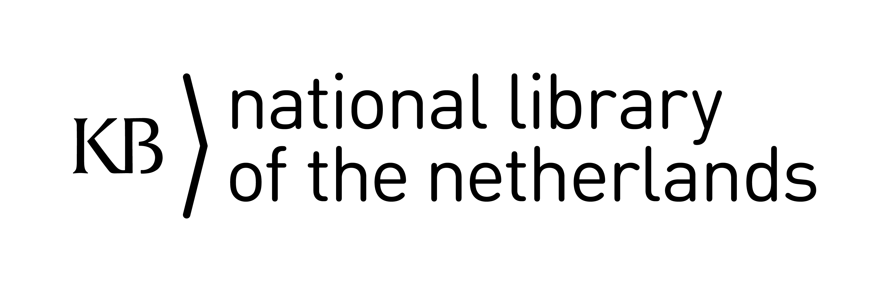
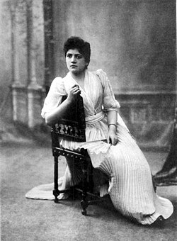
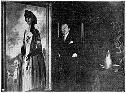
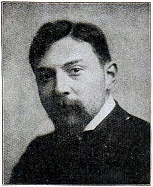
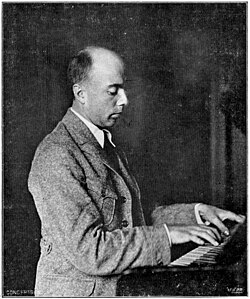

<a href="https://commons.wikimedia.org/wiki/Category:Portraits_from_Koninklijke_Bibliotheek"></a>
<a href="https://www.kb.nl/"></a>

[](https://creativecommons.org/publicdomain/zero/1.0/)
[](https://www.python.org/)
[](https://www.mediawiki.org/wiki/API:Main_page)
[](https://www.wikidata.org/wiki/Wikidata:Data_access)
[](https://commons.wikimedia.org/wiki/Category:Portraits_from_Koninklijke_Bibliotheek)
[](https://commons-query.wikimedia.org/)

# Portraits from Koninklijke Bibliotheek

Analysing and enriching structured data for portrait images from the [Koninklijke Bibliotheek](https://www.kb.nl/) (National Library of the Netherlands) on [Wikimedia Commons](https://commons.wikimedia.org/wiki/Category:Portraits_from_Koninklijke_Bibliotheek).

<table>
<tr>
<td><a href="https://commons.wikimedia.org/wiki/File:PORTRET-STUDIE._(Mej._Alida_Klein.)_van_C._E._Moegle_,_Fotograaf_Rotterdam,_1892.jpg"></a><br><sub>Alida Tartaud-Klein (1873-1938)<br>actress</sub></td>
<td><a href="https://commons.wikimedia.org/wiki/File:Han_van_Meegeren_in_z%27n_Haagsche_atelier,_1928.jpg"></a><br><sub>Han van Meegeren (1889-1947)<br>painter and art forger</sub></td>
<td><a href="https://commons.wikimedia.org/wiki/File:Emmy_Kruijt_-_Onze_Musici_(1923).jpg"></a><br><sub>Emmy Kruijt (1878-1964)<br>musician</sub></td>
</tr>
<tr>
<td><a href="https://commons.wikimedia.org/wiki/File:Portret_van_David_Schulman.jpg"></a><br><sub>David Schulman (1881-1966)<br>painter</sub></td>
<td><a href="https://commons.wikimedia.org/wiki/File:Prof._dr._G._Eyskens.jpg"></a><br><sub>Gaston Eyskens (1905-1988)<br>Belgian prime minister</sub></td>
<td><a href="https://commons.wikimedia.org/wiki/File:Alexander_Voormolen,_1931.jpg"></a><br><sub>Alexander Voormolen (1895-1980)<br>composer</sub></td>
</tr>
</table>

<sub>Example portraits from the collection on Wikimedia Commons. Click to view on Commons.</sub>

## What this project does

The Commons category [Portraits from Koninklijke Bibliotheek](https://commons.wikimedia.org/wiki/Category:Portraits_from_Koninklijke_Bibliotheek) contains over 3,000 digitised portrait images. This project checks the structured data quality of these files:

- Does each file have a **[depicts (P180)](https://www.wikidata.org/wiki/Property:P180)** statement pointing to a **human ([Q5](https://www.wikidata.org/wiki/Q5))**?
- Are the **file captions** (in English and Dutch) present and well-formed?
- Do the depicted persons have **labels and descriptions** on Wikidata?

The output is an Excel workbook and CSV files that provide a complete overview of the structured data status, enabling targeted quality improvements.

## Files

| File | Description |
|---|---|
| `portraits-from-kb-assess-depicts-q5-status.py` | Main Python script — fetches all data from Commons and Wikidata APIs and produces the Excel/CSV output |
| `kb-portraits-depicts-q5-status-YYYYMMDD.xlsx` | Excel workbook with three sheets: `all`, `missing` (no depicts), `present` (has depicts) |
| `kb-portraits-depicts-q5-status-all-YYYYMMDD.csv` | CSV export of the `all` sheet |
| `kb-portraits-depicts-q5-status-missing-YYYYMMDD.csv` | CSV export of the `missing` sheet |
| `kb-portraits-depicts-status-wmc-queries.rq` | Two SPARQL queries for the [Wikimedia Commons Query Service](https://commons-query.wikimedia.org/) |
| `portraits-from-kb-documentation.md` | Detailed documentation of the Excel structure, Python script workflow, and SPARQL queries |

## Quick start

### Prerequisites

- Python 3.7+
- A [bot account](https://commons.wikimedia.org/wiki/Commons:Bots) on Wikimedia Commons (or a regular account with bot password)

### Installation

```bash
pip install requests python-dotenv openpyxl
```

### Configuration

Create a `.env` file in the project root:

```
COMMONS_USERNAME=YourBotUsername
COMMONS_PASSWORD=YourBotPassword
COMMONS_USER_AGENT=YourBot/1.0 (https://github.com/KBNLwikimedia/portraits-from-koninklijke-bibliotheek)
```

### Usage

```bash
python portraits-from-kb-assess-depicts-q5-status.py
```

This produces three output files with a datestamp (e.g. `20260410`):
- `kb-portraits-depicts-q5-status-YYYYMMDD.xlsx`
- `kb-portraits-depicts-q5-status-all-YYYYMMDD.csv`
- `kb-portraits-depicts-q5-status-missing-YYYYMMDD.csv`

### SPARQL queries

The file `kb-portraits-depicts-status-wmc-queries.rq` contains two SPARQL queries that can be run directly on [commons-query.wikimedia.org](https://commons-query.wikimedia.org/):

1. **Grouped overview** — one row per file, depicted humans concatenated
2. **Flat listing** — one row per depicted human per file

See [portraits-from-kb-documentation.md](portraits-from-kb-documentation.md) for details.

## Excel structure

The workbook contains 12 columns across three sheets:

| Sheet | Description |
|---|---|
| `all` | All files — one row per depicted human per file |
| `missing` | Files without a depicts (P180) statement pointing to a human |
| `present` | Files with at least one depicts (P180) statement pointing to a human |

Key columns: `file`, `title`, `file_caption_en`, `file_caption_nl`, `depicts_P180`, `depicts_P180_label_en`, `depicts_P180_description_en`, `depicts_P180_label_nl`, `depicts_P180_description_nl`, `categories`, `wikidata_usage`, `wikidata_label`.

For the full column descriptions, see [portraits-from-kb-documentation.md](portraits-from-kb-documentation.md).

## See also

- [Category:Portraits from Koninklijke Bibliotheek](https://commons.wikimedia.org/wiki/Category:Portraits_from_Koninklijke_Bibliotheek) on Wikimedia Commons
- [KB national library on Wikimedia Commons](https://commons.wikimedia.org/wiki/Commons:Koninklijke_Bibliotheek)
- [KBNLwikimedia on GitHub](https://github.com/KBNLwikimedia)

## Licensing and contact

### Licensing


The Python scripts, SPARQL queries, and data files in this repo are released into the public domain under the [CC0 1.0 public domain dedication](https://creativecommons.org/publicdomain/zero/1.0/). Feel free to reuse and adapt. Attribution *(KB, National Library of the Netherlands)* is appreciated but not required.

### Contact & credits


* Author: Olaf Janssen, Wikimedia coordinator [@ KB, National Library of the Netherlands](https://www.kb.nl)
* Contact via [KB expert page](https://www.kb.nl/over-ons/experts/olaf-janssen) or [Wikimedia user page](https://commons.wikimedia.org/wiki/User:OlafJanssen).